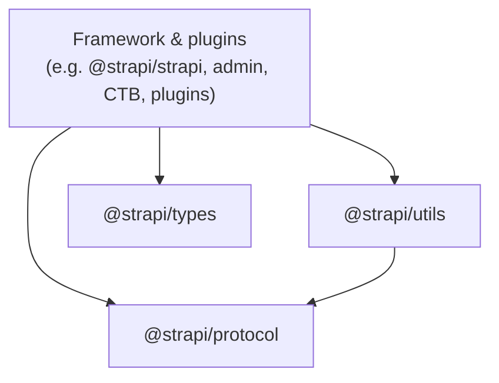
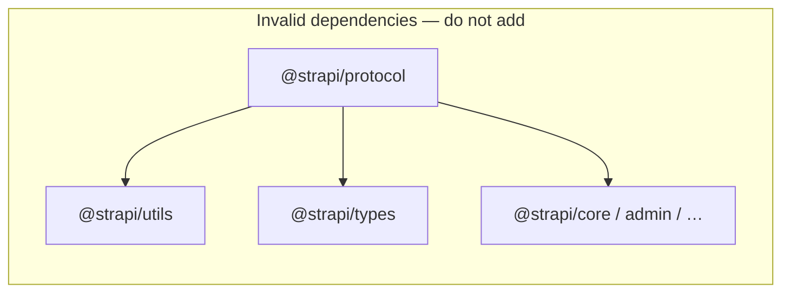

# Protocol (`@strapi/protocol`)

**`@strapi/protocol`** is a small, **semver-stable** package for **normative** Strapi rules that should be shareable without pulling the full framework: reserved names, content-type **grammar** (default attribute kinds, model/collection kinds, well-known UIDs), and Zod-oriented entry points. It is intended for Strapi packages, **CLIs, SDKs, and external services** (e.g. validation that must match the CMS) that need the same constants and schemas the server uses.

**Code location:** `packages/core/protocol/`

---

## How it fits: three layers

Strapi intentionally **does not** put every shared thing in one package. Use this split:

| Layer                | Package            | Role                                                                                                                                                                                                                                              |
| -------------------- | ------------------ | ------------------------------------------------------------------------------------------------------------------------------------------------------------------------------------------------------------------------------------------------- |
| **Protocol / spec**  | `@strapi/protocol` | Runtime **constants**, **predicates**, and **Zod** (or `z` re-exports) that answer: _“What does Strapi accept on the wire or in user-defined schema?”_ **Minimal dependencies**; must **not** import Strapi core, admin, or heavy framework code. |
| **Structural types** | `@strapi/types`    | **TypeScript** shapes for the framework, plugins, and registries. Prefer **type-only** usage where possible.                                                                                                                                      |
| **Mechanics**        | `@strapi/utils`    | **Sanitize** / **validate** visitors, generic helpers, `validateZod`, etc. **Not** the home for normative “what is allowed” lists—those belong in **protocol** so `utils` can depend on **protocol** without inverting the graph.                 |

### Dependency boundaries (Mermaid)

This documentation site already enables **Mermaid** (`@docusaurus/theme-mermaid` and `markdown.mermaid` in `docs/docusaurus.config.js`), like other Core pages (for example [Permissions](/permissions)).

**Allowed dependency direction** (arrows point from **importer** to **imported** package):

Framework and plugins consume **protocol**, **utils**, and **types**. **`@strapi/utils` may depend on `@strapi/protocol`** when reusing normative constants or predicates (keep a single source of truth in protocol).

**Must not exist** — **`@strapi/protocol`** must remain a **leaf** relative to other Strapi packages (no imports of `@strapi/utils`, `@strapi/types`, `@strapi/core`, admin, plugins, etc.):

:::note

**Reality check from `package.json`:** **`@strapi/protocol`** only pulls third-party libraries (for example `zod`, `lodash`). **`@strapi/utils`** also declares **no** `@strapi/*` runtime dependencies — keep it that way for generic helpers. **`@strapi/types`** is different: it **does** depend on several `@strapi/*` packages for structural typings; that does **not** change the rule that **protocol** stays dependency-light for external consumers.

:::

---

## What belongs in `@strapi/protocol`

Add or promote code here when **several** of the following are true:

- The value is part of a **user-facing** or **API** contract (schema grammar, reserved identifiers, stable query/body keys you want externals to validate the same way).
- **Third parties** (SDK, AI service, doc generator) should be able to `npm install @strapi/protocol` and stay aligned with a **specific Strapi release** (pin the same version as other `@strapi/*` packages in the app).
- It should **not** drag in the admin UI, Koa server, or database layer.

**Keep in the owning package** when the concern is **internal** or **feature-local**, for example:

- **Storage / migrations** internals (e.g. reserved **system** table names for the DB diff) — stay in `@strapi/database` unless you explicitly design a published storage contract.
- **Admin** routes, cookies, feature flags, or **plugin-only** UIDs that are not part of the generic content-model protocol.
- **Implementation details** of sanitization (traversal keys, visitor wiring) — stay in `@strapi/utils`; share only the **allowlists** or **predicates** via protocol if they are normative.

Naming note: CTB and schema UIs often use **snake_case** normalisation for reserved checks; Content API payloads use **camelCase** field names (`@strapi/utils` / `content-types.ts`). Protocol may hold both **concepts**; use **explicit mapping** between layers instead of one flat string list for everything.

---

## Package exports

The package uses conditional **`exports`** (see `packages/core/protocol/package.json`). Typical subpaths include:

- **`@strapi/protocol`** — barrel; re-exports the main constants and helpers as they are added.
- **`@strapi/protocol/zod`** — canonical **`z`** from the supported Zod entry (aligned with the rest of the monorepo).
- **`@strapi/protocol/reserved-names`** — reserved model/attribute names and predicates.
- **`@strapi/protocol/content-type-grammar`** — `DEFAULT_TYPES`, `modelTypes`, `typeKinds`, UID targets, core/plugin UIDs.

New subpaths should be listed in `package.json` **`exports`** and treated as **public API** (semver).

---

## Patterns

- **Predicates + Zod:** prefer **one** implementation (e.g. `isReservedAttributeName`) and have Zod refinements **call** it—avoid a duplicate `z.enum([...])` that omits wildcard rules.
- **Shims:** packages such as **Content-Type Builder** may re-export from `@strapi/protocol` so existing import paths keep working during migration.

---

## Further reading (repository)

In-repo **draft** design notes and migration checklists may live under **`docs/rfcs/`** (e.g. `protocol-package-and-shared-contracts.md`). Those files are part of the Git repository but are **not** required reading for every contributor; this page is the **canonical contributor overview** for the protocol package.
